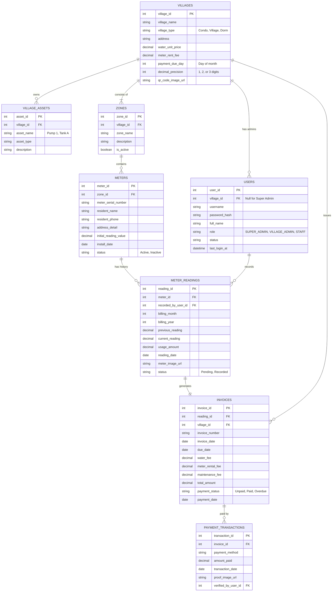

```mermaid
erDiagram
    %% Core System & Auth
    USERS {
        int user_id PK
        int village_id FK "Null for Super Admin"
        string username
        string password_hash
        string full_name
        string role "SUPER_ADMIN, VILLAGE_ADMIN, STAFF"
        string status
        datetime last_login_at
    }

    %% Master Data: Village
    VILLAGES {
        int village_id PK
        string village_name
        string village_type "Condo, Village, Dorm"
        string address
        decimal water_unit_price
        decimal meter_rent_fee
        int payment_due_day "Day of month"
        int decimal_precision "1, 2, or 3 digits"
        string qr_code_image_url
    }

    VILLAGE_ASSETS {
        int asset_id PK
        int village_id FK
        string asset_name "Pump 1, Tank A"
        string asset_type
        string description
    }

    ZONES {
        int zone_id PK
        int village_id FK
        string zone_name
        string description
        boolean is_active
    }

    %% Operational Data
    METERS {
        int meter_id PK
        int zone_id FK
        string meter_serial_number
        string resident_name
        string resident_phone
        string address_detail
        decimal initial_reading_value
        date install_date
        string status "Active, Inactive"
    }

    METER_READINGS {
        int reading_id PK
        int meter_id FK
        int recorded_by_user_id FK
        int billing_month
        int billing_year
        decimal previous_reading
        decimal current_reading
        decimal usage_amount
        date reading_date
        string meter_image_url
        string status "Pending, Recorded"
    }

    INVOICES {
        int invoice_id PK
        int reading_id FK
        int village_id FK
        string invoice_number
        date invoice_date
        date due_date
        decimal water_fee
        decimal meter_rental_fee
        decimal maintenance_fee
        decimal total_amount
        string payment_status "Unpaid, Paid, Overdue"
        date payment_date
    }

    PAYMENT_TRANSACTIONS {
        int transaction_id PK
        int invoice_id FK
        string payment_method
        decimal amount_paid
        date transaction_date
        string proof_image_url
        int verified_by_user_id FK
    }

    %% Relationships
    VILLAGES ||--o{ USERS : "has admins"
    VILLAGES ||--|{ ZONES : "consists of"
    VILLAGES ||--o{ VILLAGE_ASSETS : "owns"
    ZONES ||--o{ METERS : "contains"
    METERS ||--o{ METER_READINGS : "has history"
    USERS ||--o{ METER_READINGS : "records"
    METER_READINGS ||--|| INVOICES : "generates"
    VILLAGES ||--o{ INVOICES : "issues"
    INVOICES ||--o{ PAYMENT_TRANSACTIONS : "paid by"
```