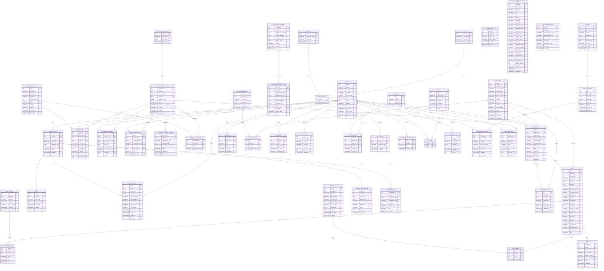

```mermaid
erDiagram
  additional_fees {
    INT fee_id PK
    INT village_id
    VARCHAR fee_name
    NUMERIC fee_amount
    BOOLEAN is_percentage
    VARCHAR percentage_basis
    BOOLEAN is_mandatory
    TEXT description
    BOOLEAN is_active
    TIMESTAMP created_at
    TIMESTAMP updated_at
  }

  alerts {
    INT alert_id PK
    INT meter_id FK
    VARCHAR alert_type
    TEXT alert_message
    TIMESTAMP alert_date
    BOOLEAN resolved
    TIMESTAMP resolved_date
  }

  auth_types {
    INT id PK
    VARCHAR name
    TEXT description
    TIMESTAMP created_at
  }

  bill_calculation_details {
    INT detail_id PK
    INT bill_id FK
    INT tier_id FK
    NUMERIC units
    NUMERIC rate
    NUMERIC amount
  }

  bill_fee_details {
    INT detail_id PK
    INT bill_id FK
    INT fee_id FK
    NUMERIC fee_amount
  }

  billing_electricity {
    INT billing_id PK
    INT meter_id FK
    DATE billing_date
    DATE due_date
    NUMERIC previous_reading
    NUMERIC current_reading
    NUMERIC consumption_kwh
    NUMERIC rate_per_kwh
    NUMERIC total_amount
    VARCHAR status
    TIMESTAMP created_at
    TIMESTAMP updated_at
    INT user_id FK
  }

  bills {
    INT bill_id PK
    INT meter_id FK
    INT reading_id FK
    VARCHAR bill_number
    DATE bill_date
    DATE due_date
    NUMERIC previous_reading
    NUMERIC current_reading
    NUMERIC consumption_units
    NUMERIC total_amount
    VARCHAR status
    TIMESTAMP created_at
    TIMESTAMP updated_at
    INT village_id
    NUMERIC minimum_charge
    NUMERIC water_rate
    NUMERIC service_fee
    NUMERIC other_fee
    NUMERIC discount
    NUMERIC net_amount
    BOOLEAN is_estimated
    VARCHAR payment_status
    DATE payment_date
    VARCHAR note
  }

  electricity_meters {
    INT meter_id PK
    INT user_id FK
    VARCHAR meter_number
    VARCHAR meter_type
    DATE installation_date
    VARCHAR location
    VARCHAR status
    TIMESTAMP created_at
    TIMESTAMP updated_at
  }

  electricity_meters_readings {
    INT reading_id PK
    INT meter_id FK
    DATE reading_date
    TIME reading_time
    NUMERIC consumption_kwh
    NUMERIC total_kwh
    VARCHAR status
    TEXT notes
    TIMESTAMP created_at
  }

  machine_alerts {
    INT alert_id PK
    VARCHAR alert_type
    INT machine_id FK
    INT part_id FK
    TIMESTAMP alert_time
    VARCHAR severity
    TEXT description
    BOOLEAN resolved
    TIMESTAMP resolved_at
    INT resolved_by FK
  }

  machine_daily_operations {
    INT operation_id PK
    INT machine_id FK
    DATE operation_date
    TIME start_time
    TIME end_time
    NUMERIC water_produced
    NUMERIC energy_consumed
    INT operator_id FK
    TEXT notes
  }

  machine_maintenance_logs {
    INT log_id PK
    INT machine_id FK
    DATE maintenance_date
    VARCHAR maintenance_type
    TEXT description
    INT performed_by FK
    NUMERIC cost
    TIMESTAMP created_at
  }

  machine_maintenance_schedule {
    INT schedule_id PK
    INT machine_id FK
    VARCHAR maintenance_type
    INT frequency_days
    DATE next_maintenance_date
    VARCHAR status
    TIMESTAMP created_at
    TIMESTAMP updated_at
  }

  machine_parts_compatibility {
    INT compatibility_id PK
    INT machine_id FK
    INT part_id FK
    VARCHAR compatibility_notes
  }

  machine_parts_inventory {
    INT part_id PK
    VARCHAR part_name
    VARCHAR part_number
    VARCHAR description
    INT quantity_in_stock
    VARCHAR unit
    NUMERIC unit_price
    VARCHAR supplier
    TIMESTAMP created_at
    TIMESTAMP updated_at
  }

  maintenance_logs {
    INT maintenance_id PK
    INT meter_id FK
    DATE maintenance_date
    VARCHAR maintenance_type
    TEXT description
    VARCHAR performed_by
    NUMERIC cost
    TIMESTAMP created_at
  }

  meter_reading_routes {
    INT route_id PK
    INT village_id
    VARCHAR route_name
    TEXT description
    TIMESTAMP created_at
    TIMESTAMP updated_at
  }

  meter_reading_schedule_history {
    INT history_id PK
    INT village_id
    INT previous_reading_day
    TIME previous_start_time
    TIME previous_end_time
    INT new_reading_day
    TIME new_start_time
    TIME new_end_time
    INT changed_by FK
    TIMESTAMP change_date
    TEXT reason
  }

  meter_reading_schedules {
    INT schedule_id PK
    INT village_id
    INT reading_day_of_month
    TIME reading_start_time
    TIME reading_end_time
    DATE effective_date
    BOOLEAN is_active
    TIMESTAMP created_at
    TIMESTAMP updated_at
  }

  meter_readings {
    INT reading_id PK
    INT meter_id FK
    DATE reading_date
    NUMERIC previous_reading
    NUMERIC current_reading
    NUMERIC consumption_units
    VARCHAR reading_status
    TEXT notes
    VARCHAR image_path
    INT reader_id FK
    TIMESTAMP created_at
    INT village_id
  }

  notifications {
    INT notification_id PK
    INT user_id FK
    VARCHAR title
    TEXT message
    BOOLEAN is_read
    TIMESTAMP created_at
  }

  ocr_requests {
    INT id PK
    INT reading_id FK
    INT user_id FK
    VARCHAR image_path
    VARCHAR status
    TEXT ocr_result
    TIMESTAMP requested_at
    TIMESTAMP completed_at
  }

  packages {
    INT id PK
    VARCHAR package_code
    VARCHAR name
    TEXT description
    NUMERIC price
    INT duration_days
    BOOLEAN is_active
    TIMESTAMP created_at
    TIMESTAMP updated_at
  }

  payments {
    INT payment_id PK
    INT bill_id FK
    DATE payment_date
    NUMERIC amount_paid
    VARCHAR payment_method
    VARCHAR reference_number
    VARCHAR status
    TIMESTAMP created_at
    TIMESTAMP updated_at
  }

  permissions {
    INT permission_id PK
    VARCHAR permission_name
    VARCHAR description
    TIMESTAMP created_at
  }

  role_permissions {
    INT role_id PK
    INT permission_id PK
  }

  roles {
    INT role_id PK
    VARCHAR role_name
    VARCHAR description
    TIMESTAMP created_at
  }

  route_meter_sequence {
    INT id PK
    INT route_id FK
    INT meter_id FK
    INT sequence_number
  }

  system_logs {
    INT log_id PK
    INT user_id FK
    VARCHAR action
    TEXT description
    TIMESTAMP log_date
    VARCHAR ip_address
  }

  uploaded_files {
    INT file_id PK
    INT uploaded_by FK
    VARCHAR file_name
    VARCHAR file_path
    VARCHAR file_type
    INT file_size
    TIMESTAMP uploaded_at
  }

  user_authentications {
    INT auth_id PK
    INT account_id FK
    INT auth_type_id FK
    VARCHAR auth_token
    TIMESTAMP created_at
    TIMESTAMP expires_at
  }

  user_passwords {
    INT password_id PK
    INT account_id FK
    VARCHAR password_hash
    TIMESTAMP created_at
    TIMESTAMP expired_at
  }

  user_village_management {
    INT user_id PK
    INT village_id PK
    VARCHAR role
    TIMESTAMP assigned_at
  }

  user_zone {
    INT user_id PK
    INT zone_id PK
  }

  users {
    INT user_id PK
    VARCHAR username
    VARCHAR password_hash
    VARCHAR full_name
    VARCHAR phone_number
    VARCHAR email
    INT role_id FK
    BOOLEAN is_active
    TIMESTAMP created_at
    TIMESTAMP last_login
    VARCHAR image_profile
    VARCHAR phone
    INT zone_id
  }

  village_alerts {
    INT id PK
    INT village_id
    VARCHAR alert_type
    TEXT message
    BOOLEAN is_read
    TIMESTAMP created_at
    INT read_by FK
  }

  village_payment_history {
    INT id PK
    INT subscription_id FK
    DATE payment_date
    NUMERIC amount
    VARCHAR payment_method
    VARCHAR transaction_id
    VARCHAR status
    TIMESTAMP created_at
    INT received_by FK
  }

  village_settings {
    INT setting_id PK
    INT village_id
    VARCHAR setting_key
    VARCHAR setting_value
    TIMESTAMP created_at
    TIMESTAMP updated_at
  }

  village_subscriptions {
    INT id PK
    INT village_id
    INT package_id FK
    DATE start_date
    DATE end_date
    VARCHAR status
    TIMESTAMP created_at
    TIMESTAMP updated_at
  }

  villages {
    INT village_id PK
    VARCHAR village_name
    VARCHAR village_no
    VARCHAR soi
    VARCHAR road
    VARCHAR district
    VARCHAR province
    VARCHAR postal_code
    VARCHAR chairman_name
    VARCHAR chairman_phone
    VARCHAR chairman_email
    VARCHAR contact_name
    VARCHAR contact_phone
    VARCHAR contact_email
    NUMERIC water_rate
    NUMERIC minimum_charge
    NUMERIC meter_rental_fee
    INT due_date
    VARCHAR bank_name
    VARCHAR account_name
    VARCHAR account_number
    VARCHAR qr_code_path
    INT decimal_places
    BOOLEAN is_active
    TIMESTAMP created_at
    TIMESTAMP updated_at
  }

  water_meters {
    INT meter_id PK
    INT village_id
    VARCHAR meter_number
    VARCHAR meter_type
    VARCHAR customer_name
    VARCHAR phone_number
    VARCHAR address
    VARCHAR zone
    DATE installation_date
    NUMERIC initial_reading
    VARCHAR status
    TIMESTAMP created_at
    TIMESTAMP updated_at
    VARCHAR line_user_id
  }

  water_production_costs {
    INT cost_id PK
    INT village_id
    NUMERIC electricity_cost_per_kwh
    NUMERIC water_source_cost
    NUMERIC chemical_cost
    NUMERIC labor_cost
    NUMERIC maintenance_cost
    TIMESTAMP created_at
    TIMESTAMP updated_at
  }

  water_production_machines {
    INT machine_id PK
    INT village_id
    VARCHAR machine_name
    INT type_id FK
    DATE installation_date
    VARCHAR status
    NUMERIC capacity_cubic_m_per_hour
    VARCHAR location
    TIMESTAMP created_at
    TIMESTAMP updated_at
  }

  water_production_types {
    INT type_id PK
    VARCHAR type_name
    TEXT description
    TIMESTAMP created_at
  }

  water_quality_tests {
    INT test_id PK
    INT machine_id FK
    DATE test_date
    VARCHAR parameter
    NUMERIC value
    VARCHAR unit
    VARCHAR result
    INT tester_id FK
    TEXT remarks
  }

  water_rate_tiers {
    INT tier_id PK
    INT village_id
    NUMERIC min_units
    NUMERIC max_units
    NUMERIC rate_per_unit
    TIMESTAMP created_at
    TIMESTAMP updated_at
  }

  zones {
    INT zone_id PK
    VARCHAR zone_name
    TEXT zone_description
    BOOLEAN is_active
    TIMESTAMP created_at
    TIMESTAMP updated_at
    INT village_id
  }

  additional_fees ||--o{ bill_fee_details : "fee_id"
  auth_types ||--o{ user_authentications : "auth_type_id"
  bills ||--o{ bill_calculation_details : "bill_id"
  bills ||--o{ bill_fee_details : "bill_id"
  bills ||--o{ payments : "bill_id"
  electricity_meters ||--o{ alerts : "meter_id"
  electricity_meters ||--o{ billing_electricity : "meter_id"
  electricity_meters ||--o{ electricity_meters_readings : "meter_id"
  electricity_meters ||--o{ maintenance_logs : "meter_id"
  machine_parts_inventory ||--o{ machine_alerts : "part_id"
  machine_parts_inventory ||--o{ machine_parts_compatibility : "part_id"
  meter_reading_routes ||--o{ route_meter_sequence : "route_id"
  meter_readings ||--o{ bills : "reading_id"
  meter_readings ||--o{ ocr_requests : "reading_id"
  meter_reading_schedules ||--o{ meter_reading_schedule_history : "schedule_id"
  packages ||--o{ village_subscriptions : "package_id"
  permissions ||--o{ role_permissions : "permission_id"
  roles ||--o{ role_permissions : "role_id"
  users ||--o{ billing_electricity : "user_id"
  users ||--o{ electricity_meters : "user_id"
  users ||--o{ machine_alerts : "resolved_by"
  users ||--o{ machine_daily_operations : "operator_id"
  users ||--o{ machine_maintenance_logs : "performed_by"
  users ||--o{ meter_readings : "reader_id"
  users ||--o{ notifications : "user_id"
  users ||--o{ ocr_requests : "user_id"
  users ||--o{ system_logs : "user_id"
  users ||--o{ uploaded_files : "uploaded_by"
  users ||--o{ user_authentications : "account_id"
  users ||--o{ user_passwords : "account_id"
  users ||--o{ user_village_management : "user_id"
  users ||--o{ user_zone : "user_id"
  users ||--o{ village_payment_history : "received_by"
  users ||--o{ village_alerts : "read_by"
  users ||--o{ water_quality_tests : "tester_id"
  village_subscriptions ||--o{ village_payment_history : "subscription_id"
  water_meters ||--o{ bills : "meter_id"
  water_meters ||--o{ meter_readings : "meter_id"
  water_meters ||--o{ route_meter_sequence : "meter_id"
  water_production_machines ||--o{ machine_alerts : "machine_id"
  water_production_machines ||--o{ machine_daily_operations : "machine_id"
  water_production_machines ||--o{ machine_maintenance_logs : "machine_id"
  water_production_machines ||--o{ machine_maintenance_schedule : "machine_id"
  water_production_machines ||--o{ machine_parts_compatibility : "machine_id"
  water_production_machines ||--o{ water_quality_tests : "machine_id"
  water_production_types ||--o{ water_production_machines : "type_id"
  water_rate_tiers ||--o{ bill_calculation_details : "tier_id"
  zones ||--o{ user_zone : "zone_id"

```